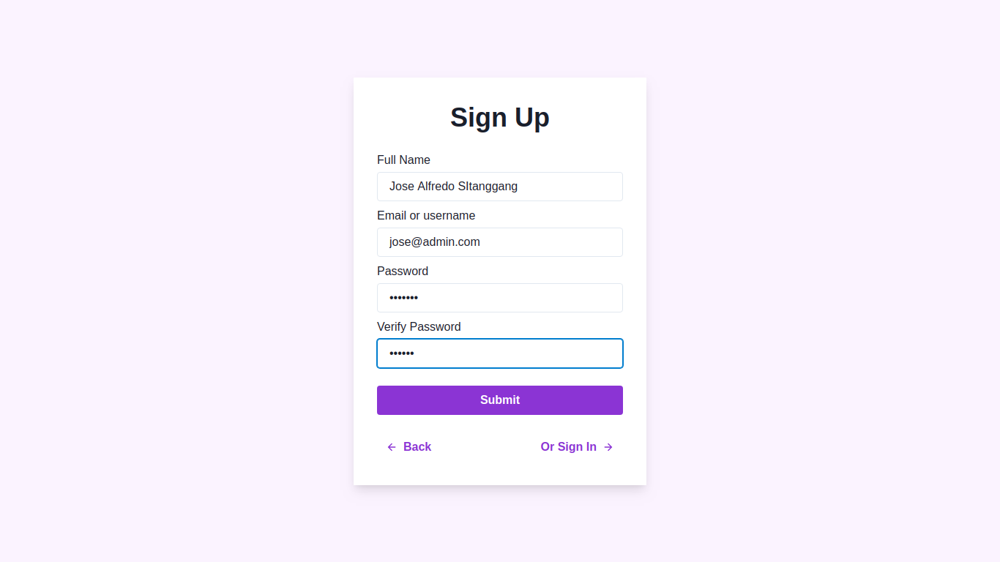
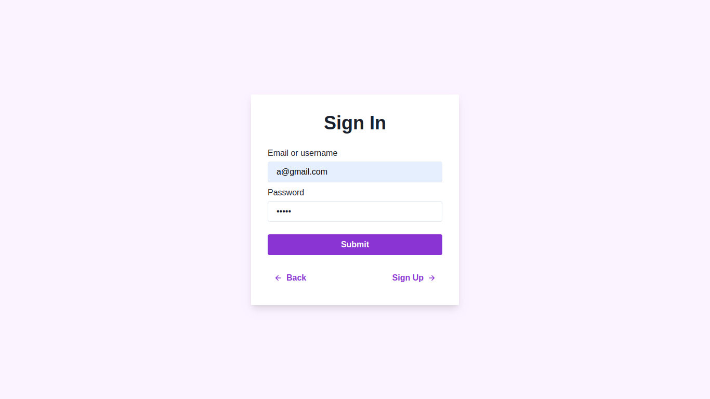
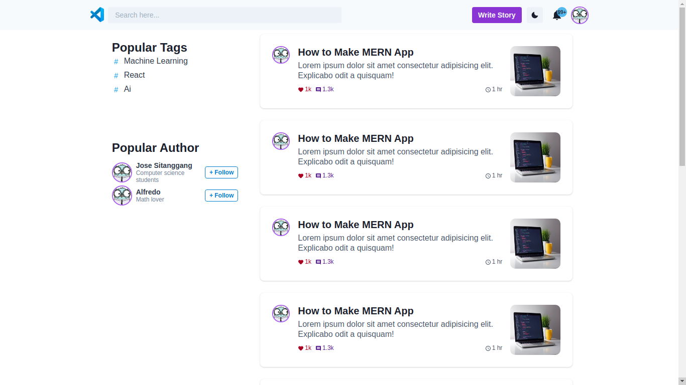
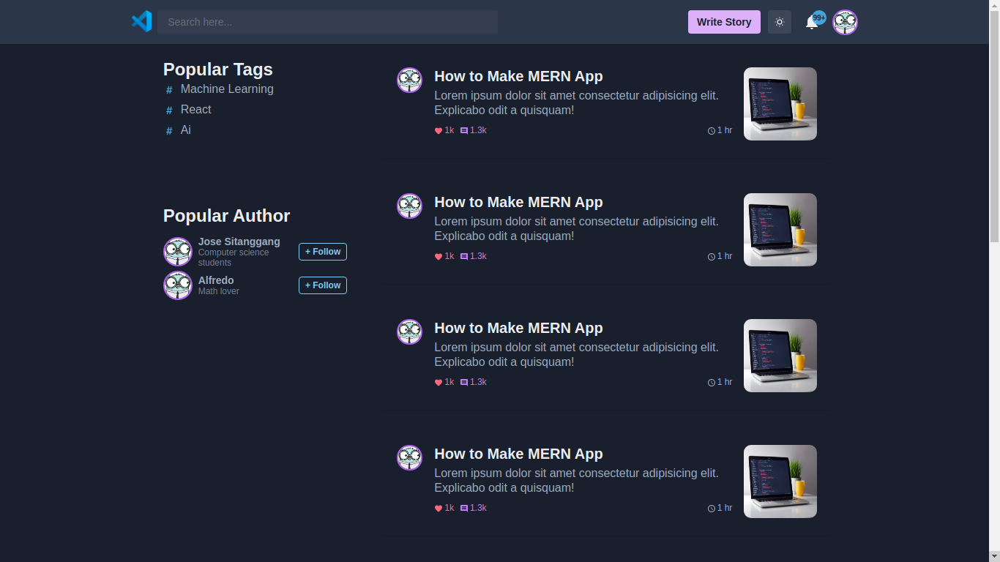
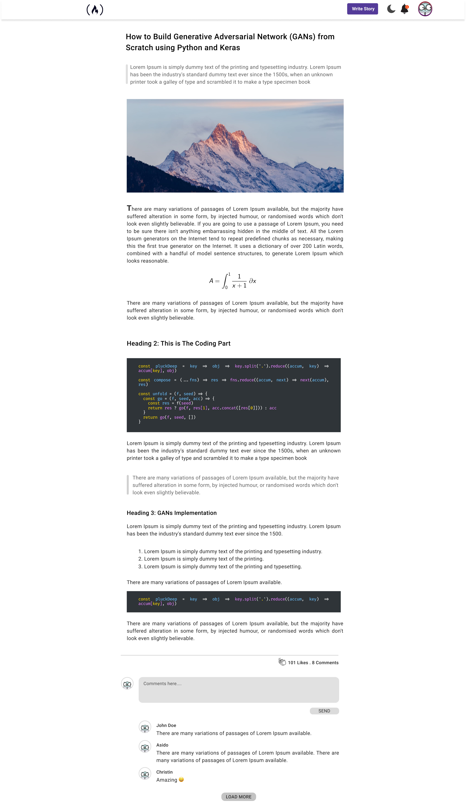
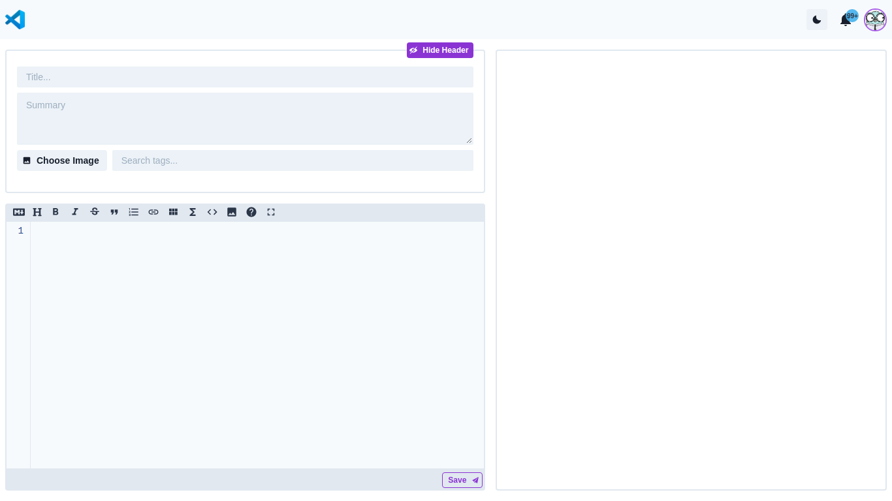
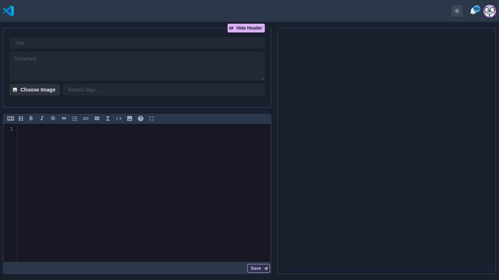
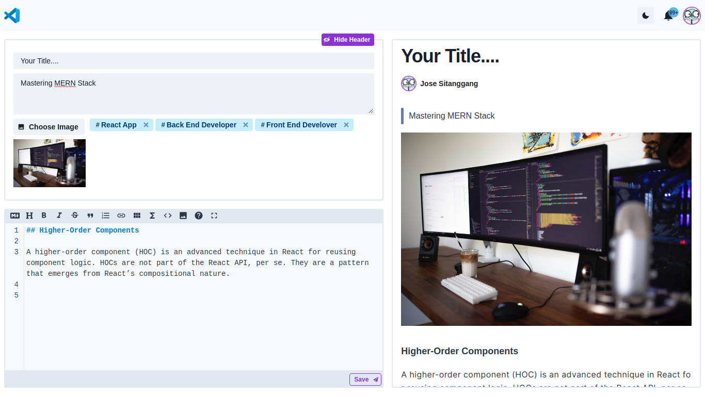
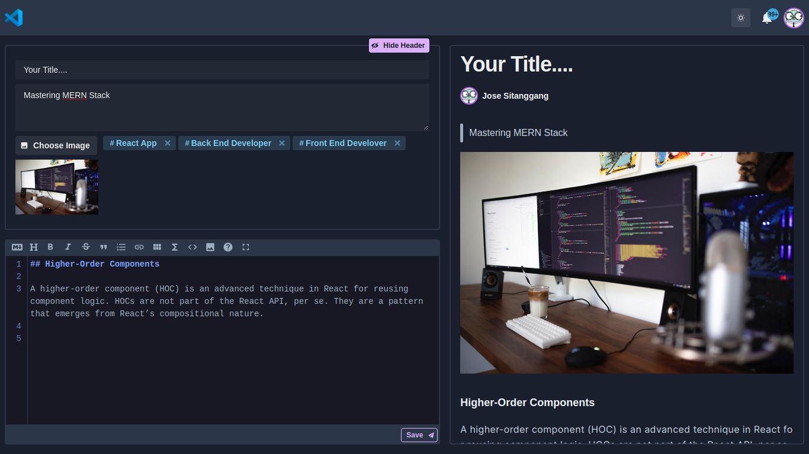

# Talkwithcode Front End


# Work Flow

1. Clone repositori ini.

```bash
$ git clone https://github.com/talkwithcode/app-frontend.git
$ cd app-frontend
$ yarn install
```

2. Buat branch baru dengan format penamaan `features/<nama-fitur-yang-dikerjakan>`

**contoh**

```bash
$ git checkout -b features/lading-page
```

3. Buat pesan commit yang deskriptif

**contoh**

```bash
$ git commit -m "added sign up UI"
```

4. Push ke branch `features` yang dibuat sebelumnya. **INGAT BUKAN KE MASTER**

**contoh**

```bash
$ git push origin features/lading-page
```

5. Ketika merasa belum yakin dengan source code yang ditulis undang aggota tim lain untuk me-review.

# Recommendation

1. Usahakan menggunakan `Prettier` agar format dari setiap anggota tim konsisten. Kalau belum ada silahkan [install](https://marketplace.visualstudio.com/items?itemName=esbenp.prettier-vscode)
2. Usahakan sebelum commit perubahan "organize imports" lebih dulu agar susunan import konsisten.

   **caranya:**

   - Tekan `CTRL + SHIFT + P`
   - Kemudian cari `organize imports`

# Directory

- `.vscode` pengaturan .vscode seperti ukuran tap. digunakan agar pengaturan tiap aggota tim sama dan commit dari perubahan yang tidak penting.
- `ui` berisi gambar yang digunakan untuk README.md
- `components` berisi reusable component
- `interfaces` berisi definisi interface yang sering digunakan diberbagi file
- `helpers` berisi fungsi atau kelas yang sifatnya hanya membantu.
- `libs` berisi kelas atau fungsi tambahan yang digunakan yang oleh component atau page namun tidak ada kaitannya dengan menrender UI.
- `pages` berisi halaman yang tersedia pada aplikasi.

# PAGES

Proyek ini memiliki 6 Halaman, yaitu:

## Landing Page

Halaman pertama yang dapat diakses oleh **pengguna baru**.

**Spec:**

1. Memiliki Sign In Form
2. Memiliki Sign Up Form
3. Memiliki Sistem validasi form sederhana, seperti:

   - Semua field dalam form harus di isi.
   - Password dan password verifikasi harus sama.

4. Interaktif pesan error jika pengguna salah mengisi form

`PATH: localhost:3000`





## Feeds Page

Halama ini menampilkan daftar feed yang di publikasikan oleh seluruh pengguna.

**Spec:**

1. Mendukung Dark Mode and Light Mode
2. Dapat Menampilkan beberapa tags yang populer
3. Dapat Menampilkan beberapa author yang populer
4. Dapat Menampilkan daftar feed yang dipublikasikan oleh semua pengguna.

`🔒 PATH: localhost:3000/feeds`




## Read Feed Page

Halaman ini menampilkan detail lengkap dari feed. Digunakan untuk membaca, memberi komentar, memberi like.

**Spec:**

1. Mendukung Dark Mode and Light Mode
2. Dapat menampikan detail feed dan mendukung beberapa fitur berikut.
   - Mendukung code highligting
   - Mendukung latex
3. Memiliki form komentar
4. Memiliki tombol like
5. Dapat menampilkan beberapa komentar yang ada pada feed

`🔒 PATH: localhost:3000/feeds/:slug`



## Editor Page

Halaman ini diguanakan untuk membuat feed baru dan menyunting sebuah feed yang sudah ada.

**Spec:**

1. Mendukung Light Mode dan Dark Mode
2. Memiliki text editor (content editor) dengan fitur sebagai berikut.
   - Mendukung Dark Mode dan Light Mode
   - Mendukung bahasa markup yaitu Markdown
   - Mempunyai code highlighting
   - Memiliki keyboard shortcut (key binding)
   - Memiliki toolbar
   - Memiliki ukuran yang fleksibel
3. Memiliki Heading editor yang terpisah dengan content editor.
4. Memiliki Gallery yang digunakan untuk memilih gambar sebagi gambar sampul untuk feed.
5. Memili fitur pencarian tag yang dapat digunakan untuk memilih jenis tag yang akan digunakan pada feed.
6. Meiliki fitur toogle header yang digunakan untuk memperbesar ruang untuk text editor
7. Memiliki Live Preview yang digunakan untuk melihat transformasi text markup ke dalam tampilan feed.
8. Mendukung auto scroll ketika preview sudah overflow

`🔒 PATH: localhost:3000/editor`







## Profile Page

Halaman ini digunakan untuk menampilkan informasi pengguna (author).

**Spec:**

1. Mendukung Light Mode dan Dark Mode
2. Dapat menampilkan informasi pengguna (author)
3. Dapat menampilkan daftar publikasi pengguna baik yang masih dalam draf maupun yang sudah di publikasikan.

`🔒 PATH: localhost:3000/profiles/:username`

_UI belum tersedia_

## Notification Page

Halaman ini digunakan untuk menampilkan daftar notifikasi.

**Spec:**

1. Mendukung Light Mode dan Dark Mode
2. Dapat menampilkan notifikasi:
   - Follower baru
   - Following membuat feed baru
   - Like dan komentar

`🔒 PATH: localhost:3000/notifications`

_UI belum tersedia_

> 🔒
> Halaman bersifat **private**. Artinya hanya dapat diakses apabila pengguna sudah melewati proses autentikasi.

# Resources

1. [Talkwitcode UI Material](https://github.com/talkwithcode/app)
2. [Chakra UI](https://chakra-ui.com/getting-started)

# Images Asset

1. https://undraw.co/
2. https://code.visualstudio.com/ (Logo vscode digunakan hanya untuk mockup saja)
3. https://www.freecodecamp.org/ (Logo freecodecamp.org digunakan hanya untuk mockup saja)

